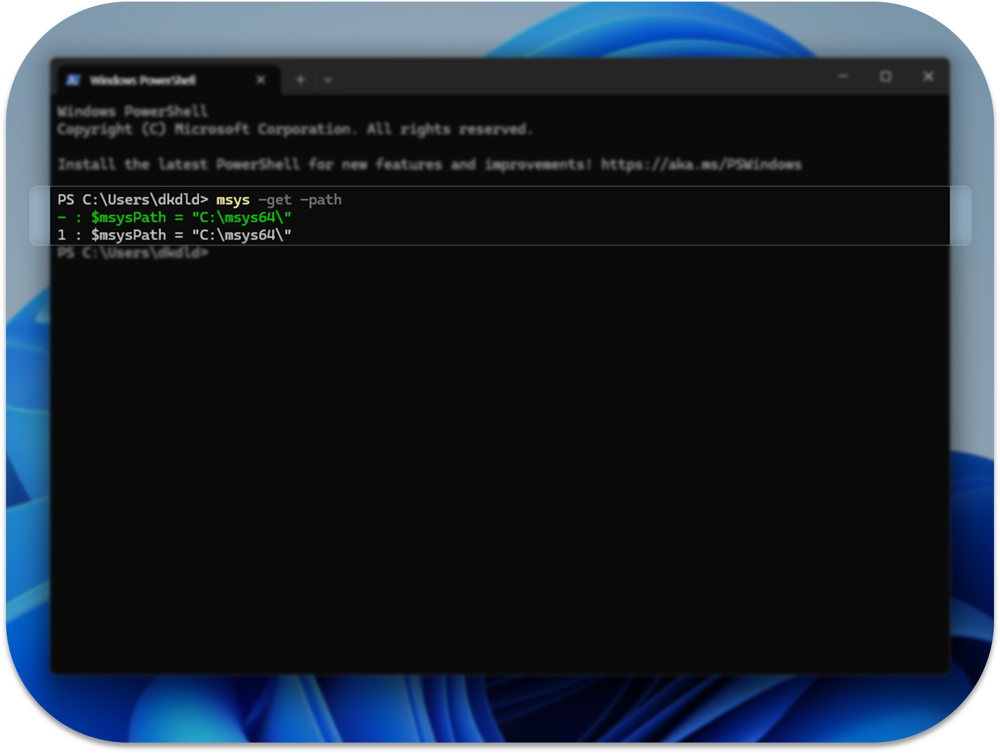

# MSYS Tool Installer

## About

A connection tool between Powershell and MSYS shell

## Feature

- 0.0.1v only for powershell. cmd is not supported yet
- Quick Access to MSYS Shell from Windows PowerShell
- Persistent Variable Assignment for MSYS Path
- Updating and Unifying Environment Variables for Cross-Platform Development

## How to install

> [!NOTE]
>
> &nbsp; MSYS-Tool-Installer.exe only serves to run [code.ps1](./dev/code.ps1). If you are concerned, you may skip this installation step and simply copy and run the code directly.

> [!NOTE] Note: About code.ps1
>
> &nbsp; [code.ps1](./dev/code.ps1) only serves to add the msys macro function to PowerShell's $PROFILE. If you are concerned, you may copy the code in $PROFILE instead

### Step 0. Set powershell

&nbsp; PowerShell maintains "Restricted" as its default execution policy.

&nbsp; The "Restricted" execution policy blocks all script execution. In order for the macro function to work in PowerShell's $PROFILE, you need to change the execution policy.

#### Step 0-0. Open powershell

&nbsp; Please run PowerShell as an administrator. You can easily do this by using one of the following methods:

- Right-click the Windows logo on the taskbar to open the Quick Link menu, then select "Terminal (Admin)".
- Or, open the Quick Link menu with the `win + x` shortcut and select "Terminal (Admin)".
- Or, open the Run dialog with `win + r`, type `powershell`, and then re-run PowerShell with administrator rights by entering the command, `Start-Process powershell -Verb RunAs`.

<center>

</center>

<br />

#### Step 0-1. Change execution policy

&nbsp; Please open PowerShell with administrator rights and enter the following command.

```powershell
Set-ExecutionPolicy RemoteSigned -Scope LocalMachine -Force
```

<center>

</center>

&nbsp; You can use the Get-ExecutionPolicy command to verify that the policy has been changed correctly

<br />

### Step 1. Install MSYS2

&nbsp; MSYS Tool 은 MSYS2 shell 경로를 powershell 와 이어주는 것 뿐이기 때문에. 별도로 MSYS2 설치를 필요로 합니다.

&nbsp; 64비트 환경의 MSYS, MSYS2는 [공식 사이트](https://www.msys2.org/)에서 설치파일을 다운로드 받을 수 있습니다.

<center>

</center>

<br />

&nbsp; 설치할 때, 설치한 경로를 기억해주셔야 합니다.

<center>

</center>

<br />

### Step 2. Install MSYS-Tool-Installer.exe

&nbsp; release 에서 최신 버전의 "MSYS-Tool-Installer.exe" 를 설치하고 실행해주세요.

<center>

</center>

<hr />
<br />

&nbsp; 디지털 서명 받지 않은 파일이기에 설치를 하려고 하면 경고할 것 입니다.

- `···` -> `유지` -> `더보기` -> `그래도 계속` 를 눌러 그대로 진행할 수 있습니다.
- 또는, "MSYS-Tool-Installer.exe" 는 어디까지나 code.ps1 을 실행하는 exe 파일에 불과합니다. 걱정되신다면 이 설치 과정을 겪지 않고 [dev/code.ps1](./dev/code.ps1) 파일을 직접 복사하여 실행해도 됩니다.

<center>

</center>

### Step 3. Run MSYS-Tool-Installer.exe

&nbsp; MSYS-Tool-Installer.exe 를 실행하면 cmd 창이 실행됩니다.

&nbsp; 설치를 할지 안할지를 묻는 질문이 출력됩니다.

```txt
This will modify the $PROFILE file. Continue? (Y/N)
```

&nbsp; 계속 설치를 진행하려면 `Y` 를 입력해주세요.

<center>

</center>

<hr />
<br />

&nbsp; powershell 의 $PROFLIE 을 아예 지우고 덮어씌울지 아니면 msys tool 내용을 추가만 할 지 묻는 질문이 출력됩니다. $PROFILE 을 새로이 쓰려면 `Y`, $PROFILE 에 남겨둬야하는 코드가 있다면 `N` 를 입력해주세요.

```txt
Do you want to completely overwrite the $PROFILE file, or select 'N' to prepend the content to it? (Y/N)
```

<center>

</center>

## How to use

### Help option

- powershell 에서 `msys -h` 을 입력하면 메뉴얼을 볼 수 있습니다.

<center>

</center>

<hr />
<br />

### Path Configuration

- `msys -get -path` 명령어로 powershell 에서 관리하는 msys 경로를 볼 수 있습니다.
- `msys -set <value> -path` 명령어로 msys 경로를 저장할 수 있습니다.

<center>

</center>
<br />

- `msys -get -path` 명령어로 powershell 에서 관리하는 msys 경로가 있다면 최상단에 초록색으로 표시되며, 없다면 붉은색으로 UNSET 이라고 출력됩니다. 또한, $PROFILE 의 몇번째 줄에 msys 경로가 저장되어있는지 전부 출력합니다. msys tool 은 자동으로 다른 경로를 정리하지만 오류 발생시 수정을 돕기 위해서 해당 정보를 출력합니다.

<center>

</center>

<hr />
<br />

### Environment Variable Configuration

- `msys -get` 명령어로 컴퓨터의 환경변수 Path 에 msys 경로가 있는지 확인할 수 있습니다.
  - USER 커서는 로컬 사용자 영역의 상태를, MACHINE 커서는 시스템 영역의 상태를 보여줍니다.
  - 환경변수에 msys 경로가 없을 경우에는 UNSET 에 커서가 위치하며, 환경변수에 msys 경로가 중복 선언되었다 판단했다면 CONFLICT 에 커서가 위치합니다.
  - msys tool 은 `msys -set <value>` 명령어시에 자동으로 환경변수에서 다른 msys 경로를 제거합니다. 허나 msys tool 를 거치지 않는 입력 등의 이유로 오류 발생을 막기위하여 CONFLICT 경고가 존재합니다.

<center>

</center>

<br />

- `msys -set <value>` 명령어로 <u><b>로컬 사용자</b></u>의 환경변수 Path 에 msys 경로를 넣을 수 있습니다.

  - ucrt64, mingw64, clang64, msys2 중 하나를 입력해야합니다.
  - msys tool 은 `msys -set <value>` 명령어시에 자동으로 환경변수에서 다른 msys 경로를 제거합니다. 허나 msys tool 를 거치지 않는 입력 등의 이유로 오류 발생을 막기위하여 CONFLICT 경고가 존재합니다.

- `msys -set <value> -admin` 명령어로 <u><b>시스템</b></u>의 환경변수 Path 에 msys 경로를 넣을 수 있습니다.
  - 기존 명령과 모든 것이 동일하지만, `-admin` 옵션은 관리자 권한으로 파워쉘을 실행하였을 경우에만 정상작동합니다.
  - 파워쉘에서 `msys -restart -admin` 명령어를 입력하면 관리자 권한으로 파워쉘을 재실행합니다.

<center>

</center>

<br />

### Launching the MSYS shell

> [!WARNING] Warning: Duplicate variable.
>
> &nbsp; msys tool 은 로컬환경과 시스템환경 각각은 단일화를 보장합니다. 하지만 사용자의 편의를 위하여 로컬환경과 시스템환경 사이에서는 중복을 허용합니다.
>
> &nbsp; 두 환경변수가 중복된 상황에서는 로컬 환경변수를 시스템 환경변수보다 우선시하기 때문에 `msys -unset` 또는 `msys -unset -admin` 명령으로 전체적으로도 단일화 상태를 유지해주는 것을 추천합니다.

- `msys` 명령어로 <u><b>로컬 사용자</b></u>의 환경변수 Path 에 따라 MSYS 쉘을 구동합니다.

- `msys -admin` 명령어로 <u><b>시스템</b></u>의 환경변수 Path 에 따라 MSYS 쉘을 구동합니다.
  - 기존 명령과 모든 것이 동일하지만, `-admin` 옵션은 관리자 권한으로 파워쉘을 실행하였을 경우에만 정상작동합니다.

<center>

</center>
