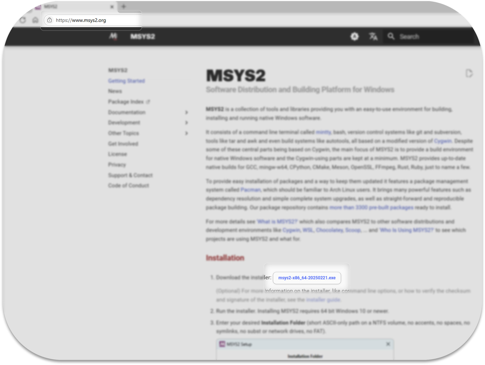

# MSYS Tool Installer

## About

A connection tool between Powershell and MSYS shell

## Feature

- 0.0.1v only for powershell. cmd is not supported yet
- Quick Access to MSYS Shell from Windows PowerShell
- Persistent Variable Assignment for MSYS Path
- Updating and Unifying Environment Variables for Cross-Platform Development

## How to install

&nbsp; 이 MsysToolInstaller.exe 은 단순히 powershell 의 $PROFLIE 에 매크로 함수 msys 를 집어넣는 역할만 합니다. 만일 exe 가 powershell $PROFILE 파일에 접근하는 것이 불쾌하다면 직접 코드를 $PROFLIE 에 입력하셔도 똑같은 기능을 사용할 수 있습니다.

### 0. Set powershell

&nbsp; 파워쉘은 기본값으로 Restricted 를 실행정책으로 유지합니다.

&nbsp; Restricted 실행정책은 모든 스크립트 실행을 차단합니다. powershell 의 $PROFLIE 에 매크로 함수가 구동되기 위해서는 실행정책을 바꿔주셔야 합니다.

&nbsp; powershell 을 관리자 권한으로 실행해주세요. 다음의 방법 중 하나로 쉽게 접근할 수 있습니다.

- 작업표시줄 윈도우 로고에 우클릭하여 퀵링크 메뉴를 열고 터미널(관리자)를 선택
- 또는, `win + x` 단축키로 퀵링크 메뉴를 열고 터미널(관리자)를 선택
- 또는, `win + r` 실행창에서 `powershell` 입력 후, `Start-Process powershell -Verb RunAs` 명령어로 관리자권한으로 재실행

<center>

</center>

<hr />
<br />

&nbsp; powershell 을 관리자 권한으로 키고 다음의 명령어를 입력해주세요.

```powershell
Set-ExecutionPolicy RemoteSigned -Scope LocalMachine -Force
```

<center>

</center>

&nbsp; Get-ExecutionPolicy 명령어로 제대로 변경되었는지 확인할 수 있습니다.

### 1. Install MSYS2

&nbsp; MSYS Tool 은 MSYS2 shell 경로를 powershell 와 이어주는 것 뿐이기 때문에. 별도로 MSYS2 설치를 필요로 합니다.

&nbsp; 64비트 환경의 MSYS, MSYS2는 [공식 사이트](https://www.msys2.org/)에서 설치파일을 다운로드 받을 수 있습니다.

<center>

</center>

<br />

&nbsp; 설치할 때, 설치한 경로를 기억해주셔야 합니다.

<center>

</center>

<br />

### 2. Install MsysToolInstaller.exe

&nbsp; release 에서 MsysToolInstaller.exe 를 설치하고 실행해주세요.

### 3. Run MsysToolInstaller.exe

- Run MsysToolInstaller.exe
- powershell 에서 확인 msys -h

## How to use
