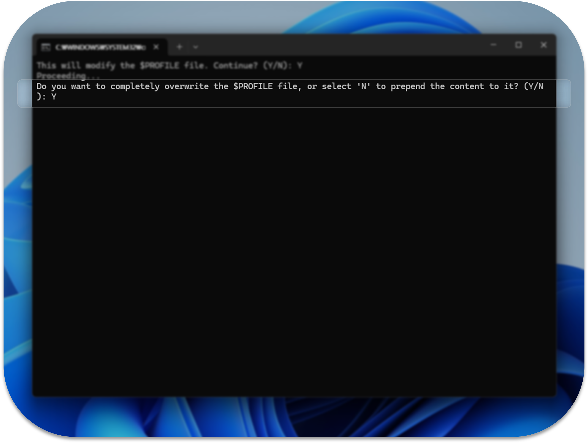

# MSYS Tool Installer

<div align=center>

</div>

## About

A connection tool between Powershell and MSYS shell

## Feature

- 0.0.1v only for powershell. cmd is not supported yet
- Quick Access to MSYS Shell from Windows PowerShell
- Persistent Variable Assignment for MSYS Path
- Updating and Unifying Environment Variables for Cross-Platform Development

## How to install

> [!NOTE]
>
> &nbsp; MSYS-Tool-Installer.exe only serves to run [code.ps1](./dev/code.ps1). If you are concerned, you may skip this installation step and simply copy and run the code directly.

> [!NOTE]
>
> &nbsp; [code.ps1](./dev/code.ps1) only serves to add the msys macro function to PowerShell's $PROFILE. If you are concerned, you may copy the code in $PROFILE instead

### Step 0. Set powershell

&nbsp; PowerShell maintains "Restricted" as its default execution policy.

&nbsp; The "Restricted" execution policy blocks all script execution. In order for the macro function to work in PowerShell's $PROFILE, you need to change the execution policy.

#### Step 0-0. Open powershell

&nbsp; Please run PowerShell as an administrator. You can easily do this by using one of the following methods:

- Right-click the Windows logo on the taskbar to open the Quick Link menu, then select "Terminal (Admin)".
- Or, open the Quick Link menu with the `win + x` shortcut and select "Terminal (Admin)".
- Or, open the Run dialog with `win + r`, type `powershell`, and then re-run PowerShell with administrator rights by entering the command, `Start-Process powershell -Verb RunAs`.

<div align=center>

</div>

<br />

#### Step 0-1. Change execution policy

&nbsp; Please open PowerShell with administrator rights and enter the following command.

```powershell
Set-ExecutionPolicy RemoteSigned -Scope LocalMachine -Force
```

<div align=center>

</div>

&nbsp; You can use the Get-ExecutionPolicy command to verify that the policy has been changed correctly

<br />

### Step 1. Install MSYS2

&nbsp; MSYS Tool only connects the MSYS2 shell path to PowerShell, so you need to install MSYS2 separately.

&nbsp; The 64-bit version of MSYS, MSYS2 can be downloaded from the [official website](https://www.msys2.org/)

<div align=center>

</div>

<br />

&nbsp; Please make sure to remember the installation path when installing.

<div align=center>

</div>

<br />

### Step 2. Install MSYS-Tool-Installer.exe

&nbsp; Please download and run the latest version of "MSYS-Tool-Installer.exe" from the Releases section.

<div align=center>

</div>

<br />

&nbsp; Because this file is not signed, you may see a warning when you try to install it.

- You can proceed by clicking `···` -> `Keep` -> `More` -> `Run anyway`.
- Or, "MSYS-Tool-Installer.exe" is simply an executable that runs code.ps1. If you are concerned, you can skip the installer and run [dev/code.ps1](./dev/code.ps1) directly by copying it yourself.

<div align=center>

</div>

### Step 3. Run MSYS-Tool-Installer.exe

&nbsp; When you run MSYS-Tool-Installer.exe, a command prompt window will open.

&nbsp; You will be asked whether you want to proceed with the installation.

```txt
This will modify the $PROFILE file. Continue? (Y/N)
```

&nbsp; To continue with the installation, enter `Y`.

<div align=center>

</div>

<br />

&nbsp; Next, you will be prompted to choose whether to completely overwrite your PowerShell $PROFILE or just add the MSYS Tool content.
Enter `Y` if you want to create a new $PROFILE, or `N` if you have existing code in your $PROFILE that you want to keep.

```txt
Do you want to completely overwrite the $PROFILE file, or select 'N' to prepend the content to it? (Y/N)
```

<div align=center>

</div>

## How to use

### Help option

- You can view the manual by entering `msys -h` in PowerShell.

<div align=center>

</div>

<br />

### Path Configuration

- Use the `msys -get -path` command to check the MSYS path currently managed by PowerShell.
- Use the `msys -set <value> -path` command to set the MSYS path

<div align=center>

</div>
<br />

- When you use the `msys -get -path` command, the MSYS path managed by PowerShell will be displayed at the top in green if it is set. If no path is set, "UNSET" will be shown in red. Additionally, all line numbers in your $PROFILE where the MSYS path is stored will be displayed.
  MSYS Tool automatically cleans up other paths, but this information is provided to help you manually fix any issues that may occur.

<div align=center>

</div>

<hr />
<br />

### Environment Variable Configuration

- The `msys -get` command allows you to check whether the MSYS path exists in your computer’s environment variable Path.
  - The <b>USER</b> cursor indicates the status in the local user scope, while the <b>MACHINE</b> cursor shows the status in the system scope.
  - If the MSYS path is not present in the environment variable, the cursor will be positioned at <b>UNSET</b>. If the MSYS path is detected as being declared multiple times, the cursor will be positioned at <b>CONFLICT</b>.
  - When you use the `msys -set <value>` command, MSYS Tool will automatically remove any other MSYS paths from the environment variable. However, the <b>CONFLICT</b> warning exists to help prevent errors that may occur if changes are made outside of MSYS Tool or through other means.

<div align=center>

</div>

<br />

- Use the `msys -set <value>` command to add the MSYS path to the environment variable Path for the <b>local</b>

  - You must specify one of the following: [ ucrt64, mingw64, clang64, or msys2 ].
  - When you use the `msys -set <value>` command, MSYS Tool will automatically remove any other MSYS paths from the environment variable. However, the <b>CONFLICT</b> warning exists to help prevent errors that may occur if changes are made outside of MSYS Tool or by other means.

- Use the `msys -set <value> -admin` command to add the MSYS path to the environment variable Path for the <b>system</b>
  - This command works the same as the previous one, but the `-admin` option only works properly if PowerShell is running with administrator rights.
  - You can restart PowerShell with administrator rights by entering `msys -restart -admin` in PowerShell.

<div align=center>

</div>

<br />

### Launching the MSYS shell

> [!WARNING] Warning: Duplicate variable.
>
> &nbsp; MSYS Tool ensures a unified MSYS path within each environments(local and system) individually. However, for user convenience, it allows duplication of the MSYS path between the local and system environment variables.
>
> &nbsp; If both environments(local and system) variables are set, the local user environment variable takes precedence over the system environment variable. For stable, it is recommended to use the `msys -unset` and `msys -unset -admin` commands to remove duplicates path value.

- The `msys` command launches the MSYS shell according to the MSYS path set in the <u><b>local</b></u> environment variable.

- The `msys -admin` command launches the MSYS shell according to the MSYS path set in the <u><b>system</b></u> environment variable.
  - This command works the same as the previous one, but the `-admin` option only works properly if PowerShell is running with administrator rights.

<div align=center>

</div>
